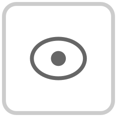

# ❔ Information

Keep in mind, this is not the work of a trained programmer, just a retired self-learner.

The intended usage is:

1. Load your **study material** [^1] into <kbd>book.md</kbd>. It displays in second column. 

2. Set book links to target="ext" (or modify ext-links.js) which will open in the third column.

3. Use the buttons in the top bar as is [^2] or reconfigure them as you wish.

4. Fill in or create other pages, as desired. Don't forget the front matter.

# Credits

## Design inspiration from:  

Retype - [https://retype.com](https://retype.com){:target="_blank"}

Slate - [https://github.com/slatedocs/slate](https://github.com/slatedocs/slate){:target="_blank"}

LibDoc - [https://github.com/olivier3lanc/Jekyll-LibDoc](https://github.com/olivier3lanc/Jekyll-LibDoc){:target="_blank"}

## Code hosting & wrangling from:  

Github Pages - [https://pages.github.com](https://pages.github.com){:target="_blank"}  

Jekyll - [https://jekyllrb.com/docs/github-pages](https://jekyllrb.com/docs/github-pages){:target="_blank"}  

Kramdown - [https://kramdown.gettalong.org/syntax.html](https://kramdown.gettalong.org/syntax.html){:target="_blank"}

## Free code advice from:  

W3 Schools - [https://www.w3schools.com/howto/howto_js_add_class.asp](https://www.w3schools.com/howto/howto_js_add_class.asp){:target="_blank"}  

Stack Overflow - [https://stackoverflow.com](https://stackoverflow.com){:target="_blank"}  

Allejo - [https://allejo.io/projects/jekyll/projects](https://allejo.io/projects/jekyll/projects){:target="_blank"}

## Third party free-tier services from:  

Hypothes.is - [https://web.hypothes.is/everyone](https://web.hypothes.is/everyone){:target="_blank"}  

Whereby - [https://whereby.com](https://whereby.com){:target="_blank"}  

Crisp - [https://crisp.chat/en](https://crisp.chat/en){:target="_blank"}  

Testimonial - [https://testimonial.to](https://testimonial.to){:target="_blank"}  

Mapbox - [https://www.mapbox.com](https://www.mapbox.com){:target="_blank"}

## Open source info & services from:  

Wikipedia - [https://en.m.wikipedia.org](https://www.wikipedia.org){:target="_blank"}  

Wikicionário - [https://en.m.wiktionary.org](https://www.wiktionary.org){:target="_blank"}  

OpenStreetMap - [https://www.openstreetmap.org](https://www.openstreetmap.org){:target="_blank"}

Warning: Check if the site you are linking to allows it to be loaded into an iframe. Also, since this platform is responsive, use the mobile URL, if one exists (i.e. m.wikipedia.org instead of wikipedia.org).

Note: We are using Jekyll SSG with Kramdown but you are free to modify it to your liking.

Our Lighthouse report can be viewed [here](./lighthouse.html){:target="ext"} (Hypothes.is turned off and iframe blank)

---

Nosso projeto integra ferramentas geralmente achadas em eReaders (dicionário, tipo de letra, fundo de contraste, espaço entre-linhas, etc)

- [Wikipedia](https://en.m.wikipedia.org){:target="ext"}
- [Wikicionário](https://en.m.wiktionary.org){:target="ext"}
- [Hypothes.is](https://web.hypothes.is/everyone/){:target="ext"}
- [Whereby](https://whereby.com){:target="ext"}
- [Crisp](https://crisp.chat/en/){:target="_blank"}

Os botões no canto superior direito pertencem ao Anotador <a target="_blank" href="https://web-hypothes-is.translate.goog/everyone/?_x_tr_sl=es&_x_tr_tl=pt&_x_tr_hl=en&_x_tr_pto=wapp">Hypothes.is</a> e servem para:

<table class="border p-10 fs-3 ff-slab col2-w ml-10">
<tr class="bg-lg"><th style="width: 20%">Ícone</th><th>Ação</th></tr>
<tr><td class="center"></td><td>Mostrar/esconder barra de anotações</td></tr>
<tr><td class="center"></td><td>Mostras/esconder anotações (grifados em amarelo)</td></tr>
<tr><td class="center"></td><td>Criar nova anotação de página</td></tr>
</table>

&nbsp;

&nbsp;

&nbsp;

[^1]: MD-formatted, mind its copyright license and its fair use.

[^2]: Some builtin services require signup, but all have a free tier.

---
