

# ⚓ [The Naval Treaty](The_Adventure_of_the_Naval_Treaty){:.w}  

**by [Sir Arthur Conan Doyle](Arthur_Conan_Doyle){:.w}**  

👨‍⚕️ The July which immediately succeeded my marriage was made memorable by three cases of interest, in which I had the privilege of being
associated with [Sherlock Holmes](Sherlock_Holmes){:.w} and of studying his methods. I find them recorded in my notes under the headings of “[The Adventure of the
Second Stain](The_Adventure_of_the_Second_Stain){:.w},” “The Adventure of the Naval Treaty,” and “The Adventure of the Tired Captain.” The first of these, however, deals
with interest of such importance and implicates so many of the first families in the [kingdom](United_Kingdom_of_Great_Britain_and_Ireland){:.w} that for many years it will be impossible to make it public. No case, however, in which Holmes was engaged has ever illustrated the value of his analytical methods so clearly or has impressed those who were associated with him so deeply. I still retain an almost [verbatim](verbatim){:.d}   report of the interview in which he demonstrated the true facts of the case to Monsieur Dubugue of the [Paris](paris){:.m} police, and Fritz von Waldbaum, the well-known specialist of [Dantzig](gdansk){:.m}, both of whom had wasted their energies upon what proved to
be side-issues. The new century will have come, however, before the story can be safely told. Meanwhile I pass on to the second on my list, which promised also at one time to be of national importance, and was marked by several incidents which give it a quite unique character.

During my school-days I had been intimately associated with a lad named Percy Phelps, who was of much the same age as myself, though he was two classes ahead of me. He was a very brilliant boy, and carried away every prize which the school had to offer, finishing his exploits by winning a scholarship which sent him on to continue his triumphant career at [Cambridge](University_of_Cambridge){:.w}. He was, I remember, extremely well connected, and even when we were all little boys together we knew that his mother’s brother was Lord Holdhurst, the great conservative politician. This [gaudy](gaudy){:.d} relationship did him little good at school. On the contrary, it seemed rather a [piquant](piquant){:.d} thing to us to [chevy](chevy){:.d} him about the playground and hit him over the shins with a wicket. But it was another thing when he came out into the world. I heard vaguely that his abilities and the influences which he commanded had won him a good position at the [Foreign Office](Foreign,_Commonwealth_and_Development_Office){:.w}, and then he passed completely out of my mind until the following letter recalled his existence:

> 📃 Briarbrae, [Woking](woking,%20uk){:.m}. 
> 
> My dear [Watson](Dr._Watson){:.w}: I have no doubt that you can remember “Tadpole” Phelps, who was in the fifth form when you were in the third. It is possible even that you may have heard that through my uncle’s influence I obtained a good appointment at the Foreign Office, and that I was in a situation of trust and honor until a horrible misfortune came suddenly to blast my career. 
> 
> There is no use writing of the details of that dreadful event. In the event of your acceding to my request it is probable that I shall have to narrate them to you. I have only just recovered from nine weeks of brain-fever, and am still exceedingly weak. Do you think that you could bring your friend Mr. Holmes down to see me? I should like to have his opinion of the case, though the authorities assure me that nothing more can be done. Do try to bring him down, and as soon as possible. Every minute seems an hour while I live in this state of horrible suspense. Assure him that if I have not asked his advice sooner it was not because I did not appreciate his talents, but because I have been off my head ever since the blow fell. Now I am clear again, though I dare not think of it too much for fear of a relapse. I am still so weak that I have to write, as you see, by dictating. Do try to bring him. 
> 
> Your old school-fellow,  
> Percy Phelps.
{:.grey}

There was something that touched me as I read this letter, something
pitiable in the reiterated appeals to bring Holmes. So moved was I
that even had it been a difficult matter I should have tried it, but
of course I knew well that Holmes loved his art, so that he was ever
as ready to bring his aid as his client could be to receive it. My
wife agreed with me that not a moment should be lost in laying the
matter before him, and so within an hour of breakfast-time I found
myself back once more in the old rooms in [Baker Street](https://www.google.com/maps/embed?pb=!4v1701310070331!6m8!1m7!1sxcpfEVXzdOSLfJZ8-e78WQ!2m2!1d51.52377182736027!2d-0.1582448794529913!3f271.9495810431267!4f-4.3476454619505205!5f2.4318179095155026).

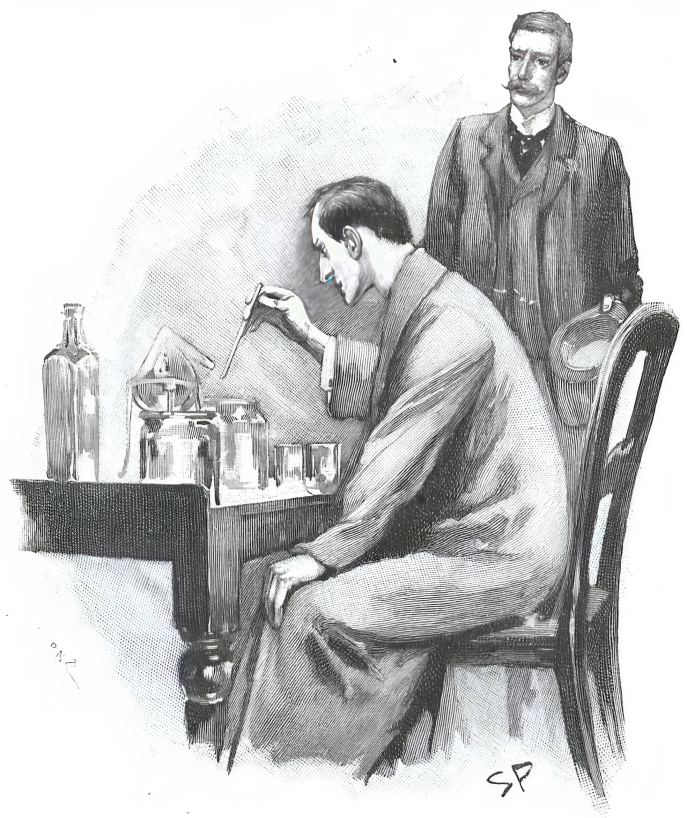

Holmes was seated at his side-table clad in his dressing-gown, and
working hard over a chemical investigation. A large curved retort was
boiling furiously in the bluish flame of a [Bunsen burner](Bunsen_burner){:.w}, and the
distilled drops were condensing into a two-litre measure. My friend
hardly glanced up as I entered, and I, seeing that his investigation
must be of importance, seated myself in an arm-chair and waited. He
dipped into this bottle or that, drawing out a few drops of each with
his glass pipette, and finally brought a test-tube containing a
solution over to the table. In his right hand he held a slip of
[litmus-paper](Litmus){:.w}.

🕵️‍♂️ “You come at a crisis, Watson,” said he. “If this paper remains blue,
all is well. If it turns red, it means a man’s life.” He dipped it
into the test-tube and it flushed at once into a dull, dirty crimson.
“Hum! I thought as much!” he cried. “I will be at your service in an
instant, Watson. You will find tobacco in the Persian slipper.” He
turned to his desk and scribbled off several telegrams, which were
handed over to the page-boy. Then he threw himself down into the
chair opposite, and drew up his knees until his fingers clasped round
his long, thin shins.

🕵️‍♂️ “A very commonplace little murder,” said he. “You’ve got something
better, I fancy. You are the stormy petrel of crime, Watson. What is
it?”

I handed him the letter, which he read with the most concentrated
attention.

🕵️‍♂️ “It does not tell us very much, does it?” he remarked, as he handed
it back to me.

👨‍⚕️ “Hardly anything.”

🕵️‍♂️ “And yet the writing is of interest.”

👨‍⚕️ “But the writing is not his own.”

🕵️‍♂️ “Precisely. It is a woman’s.”

👨‍⚕️ “A man’s surely,” I cried.

🕵️‍♂️ “No, a woman’s, and a woman of rare character. You see, at the
commencement of an investigation it is something to know that your
client is in close contact with some one who, for good or evil, has
an exceptional nature. My interest is already awakened in the case.
If you are ready we will start at once for Woking, and see this
diplomatist who is in such evil case, and the lady to whom he
dictates his letters.”

We were fortunate enough to catch an early train at Waterloo, and in
a little under an hour we found ourselves among the fir-woods and the
heather of Woking. Briarbrae proved to be a large detached house
standing in extensive grounds within a few minutes’ walk of the
station. On sending in our cards we were shown into an elegantly
appointed drawing-room, where we were joined in a few minutes by a
rather stout man who received us with much hospitality. His age may
have been nearer forty than thirty, but his cheeks were so ruddy and
his eyes so merry that he still conveyed the impression of a plump
and mischievous boy.

“I am so glad that you have come,” said he, shaking our hands with
effusion. “Percy has been inquiring for you all morning. Ah, poor old
chap, he clings to any straw! His father and his mother asked me to
see you, for the mere mention of the subject is very painful to
them.”

🕵️‍♂️ “We have had no details yet,” observed Holmes. “I perceive that you
are not yourself a member of the family.”

Our acquaintance looked surprised, and then, glancing down, he began
to laugh.

“Of course you saw the J H monogram on my locket,” said he. “For a
moment I thought you had done something clever. Joseph Harrison is my
name, and as Percy is to marry my sister Annie I shall at least be a
relation by marriage. You will find my sister in his room, for she
has nursed him hand-and-foot this two months back. Perhaps we’d
better go in at once, for I know how impatient he is.”

The chamber in which we were shown was on the same floor as the
drawing-room. It was furnished partly as a sitting and partly as a
bedroom, with flowers arranged daintily in every nook and corner. A
young man, very pale and worn, was lying upon a sofa near the open
window, through which came the rich scent of the garden and the balmy
summer air. A woman was sitting beside him, who rose as we entered.

👰🏾‍♀️ “Shall I leave, Percy?” she asked.

He clutched her hand to detain her. 

🤵🏻‍♂️ “How are you, Watson?” said he,
cordially. 

🤵🏻‍♂️ “I should never have known you under that moustache, and I
dare say you would not be prepared to swear to me. This I presume is
your celebrated friend, Mr. Sherlock Holmes?”

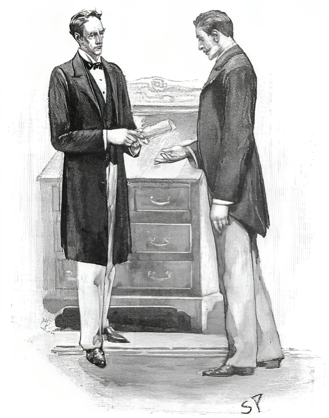

I introduced him in a few words, and we both sat down. The stout
young man had left us, but his sister still remained with her hand in
that of the invalid. She was a striking-looking woman, a little short
and thick for symmetry, but with a beautiful olive complexion, large,
dark, Italian eyes, and a wealth of deep black hair. Her rich tints
made the white face of her companion the more worn and haggard by the
contrast.

🤵🏻‍♂️ “I won’t waste your time,” said he, raising himself upon the sofa.

🤵🏻‍♂️ “I’ll plunge into the matter without further preamble. I was a happy
and successful man, Mr. Holmes, and on the eve of being married, when
a sudden and dreadful misfortune wrecked all my prospects in life.

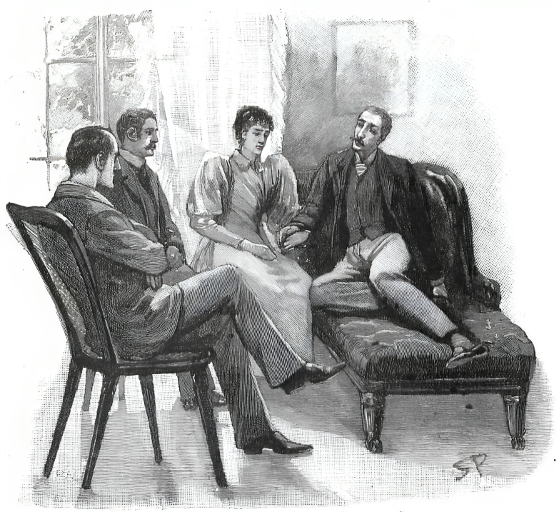

🤵🏻‍♂️ “I was, as Watson may have told you, in the Foreign Office, and
through the influences of my uncle, Lord Holdhurst, I rose rapidly to
a responsible position. When my uncle became foreign minister in this
administration he gave me several missions of trust, and as I always
brought them to a successful conclusion, he came at last to have the
utmost confidence in my ability and tact.

🤵🏻‍♂️ “Nearly ten weeks ago--to be more accurate, on the twenty-third of
May--he called me into his private room, and, after complimenting me
on the good work which I had done, he informed me that he had a new
commission of trust for me to execute.

“‘This,’ said he, taking a gray roll of paper from his bureau, ‘is
the original of that secret treaty between England and Italy of
which, I regret to say, some rumors have already got into the public
press. It is of enormous importance that nothing further should leak
out. The French or the Russian embassy would pay an immense sum to
learn the contents of these papers. They should not leave my bureau
were it not that it is absolutely necessary to have them copied. You
have a desk in your office?’

🤵🏻‍♂️ “‘Yes, sir.’

“‘Then take the treaty and lock it up there. I shall give directions
that you may remain behind when the others go, so that you may copy
it at your leisure without fear of being overlooked. When you have
finished, relock both the original and the draft in the desk, and
hand them over to me personally to-morrow morning.’

🤵🏻‍♂️ “I took the papers and--”

🕵️‍♂️ “Excuse me an instant,” said Holmes. “Were you alone during this
conversation?”

🤵🏻‍♂️ “Absolutely.”

🕵️‍♂️ “In a large room?”

🤵🏻‍♂️ “Thirty feet each way.”

🕵️‍♂️ “In the centre?”

🤵🏻‍♂️ “Yes, about it.”

🕵️‍♂️ “And speaking low?”

🤵🏻‍♂️ “My uncle’s voice is always remarkably low. I hardly spoke at all.”

🕵️‍♂️ “Thank you,” said Holmes, shutting his eyes; “pray go on.”

🤵🏻‍♂️ “I did exactly what he indicated, and waited until the other clerks
had departed. One of them in my room, Charles Gorot, had some arrears
of work to make up, so I left him there and went out to dine. When I
returned he was gone. I was anxious to hurry my work, for I knew that
Joseph--the Mr. Harrison whom you saw just now--was in town, and that
he would travel down to Woking by the eleven-o’clock train, and I
wanted if possible to catch it.

🤵🏻‍♂️ “When I came to examine the treaty I saw at once that it was of such
importance that my uncle had been guilty of no exaggeration in what
he had said. Without going into details, I may say that it defined
the position of Great Britain towards the Triple Alliance, and
fore-shadowed the policy which this country would pursue in the event
of the French fleet gaining a complete ascendancy over that of Italy
in the Mediterranean. The questions treated in it were purely naval.
At the end were the signatures of the high dignitaries who had signed
it. I glanced my eyes over it, and then settled down to my task of
copying.

🤵🏻‍♂️ “It was a long document, written in the French language, and
containing twenty-six separate articles. I copied as quickly as I
could, but at nine o’clock I had only done nine articles, and it
seemed hopeless for me to attempt to catch my train. I was feeling
drowsy and stupid, partly from my dinner and also from the effects of
a long day’s work. A cup of coffee would clear my brain. A
commissionaire remains all night in a little lodge at the foot of the
stairs, and is in the habit of making coffee at his spirit-lamp for
any of the officials who may be working over time. I rang the bell,
therefore, to summon him.

🤵🏻‍♂️ “To my surprise, it was a woman who answered the summons, a large,
coarse-faced, elderly woman, in an apron. She explained that she was
the commissionaire’s wife, who did the charing, and I gave her the
order for the coffee.

🤵🏻‍♂️ “I wrote two more articles and then, feeling more drowsy than ever, I
rose and walked up and down the room to stretch my legs. My coffee
had not yet come, and I wondered what was the cause of the delay
could be. Opening the door, I started down the corridor to find out.
There was a straight passage, dimly lighted, which led from the room
in which I had been working, and was the only exit from it. It ended
in a curving staircase, with the commissionaire’s lodge in the
passage at the bottom. Half way down this staircase is a small
landing, with another passage running into it at right angles. This
second one leads by means of a second small stair to a side door,
used by servants, and also as a short cut by clerks when coming from
Charles Street. Here is a rough chart of the place.”

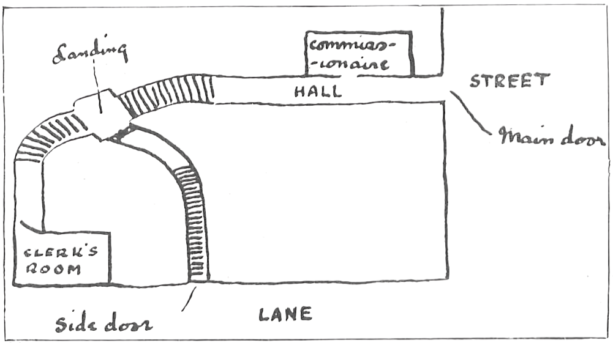

🕵️‍♂️ “Thank you. I think that I quite follow you,” said Sherlock Holmes.

🤵🏻‍♂️ “It is of the utmost importance that you should notice this point. I
went down the stairs and into the hall, where I found the
commissionaire fast asleep in his box, with the kettle boiling
furiously upon the spirit-lamp. I took off the kettle and blew out
the lamp, for the water was spurting over the floor. Then I put out
my hand and was about to shake the man, who was still sleeping
soundly, when a bell over his head rang loudly, and he woke with a
start.

👮🏼‍♂️ “‘Mr. Phelps, sir!’ said he, looking at me in bewilderment.

🤵🏻‍♂️ “‘I came down to see if my coffee was ready.’

👮🏼‍♂️ “‘I was boiling the kettle when I fell asleep, sir.’ He looked at me
and then up at the still quivering bell with an ever-growing
astonishment upon his face.

👮🏼‍♂️ “‘If you was here, sir, then who rang the bell?’ he asked.

🤵🏻‍♂️ “‘The bell!’ I cried. ‘What bell is it?’

👮🏼‍♂️ “‘It’s the bell of the room you were working in.’

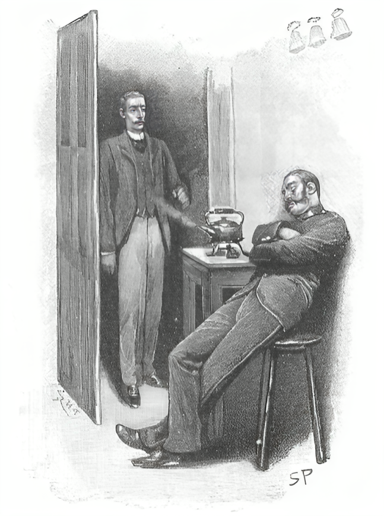

🤵🏻‍♂️ “A cold hand seemed to close round my heart. Some one, then, was in
that room where my precious treaty lay upon the table. I ran
frantically up the stair and along the passage. There was no one in
the corridors, Mr. Holmes. There was no one in the room. All was
exactly as I left it, save only that the papers which had been
committed to my care had been taken from the desk on which they lay.
The copy was there, and the original was gone.”

Holmes sat up in his chair and rubbed his hands. I could see that the
problem was entirely to his heart. 

🕵️‍♂️ “Pray, what did you do then?” he
murmured.

🤵🏻‍♂️ “I recognized in an instant that the thief must have come up the
stairs from the side door. Of course I must have met him if he had
come the other way.”

🕵️‍♂️ “You were satisfied that he could not have been concealed in the room
all the time, or in the corridor which you have just described as
dimly lighted?”

🤵🏻‍♂️ “It is absolutely impossible. A rat could not conceal himself either
in the room or the corridor. There is no cover at all.”

🕵️‍♂️ “Thank you. Pray proceed.”

🤵🏻‍♂️ “The commissionaire, seeing by my pale face that something was to be
feared, had followed me upstairs. Now we both rushed along the
corridor and down the steep steps which led to Charles Street. The
door at the bottom was closed, but unlocked. We flung it open and
rushed out. I can distinctly remember that as we did so there came
three chimes from a neighboring clock. It was quarter to ten.”

🕵️‍♂️ “That is of enormous importance,” said Holmes, making a note upon his
shirt-cuff.

🤵🏻‍♂️ “The night was very dark, and a thin, warm rain was falling. There
was no one in Charles Street, but a great traffic was going on, as
usual, in Whitehall, at the extremity. We rushed along the pavement,
bare-headed as we were, and at the far corner we found a policeman
standing.

🤵🏻‍♂️ “‘A robbery has been committed,’ I gasped. ‘A document of immense
value has been stolen from the Foreign Office. Has any one passed
this way?’

💂🏻 “‘I have been standing here for a quarter of an hour, sir,’ said he;
‘only one person has passed during that time--a woman, tall and
elderly, with a Paisley shawl.’

👮🏼‍♂️ “‘Ah, that is only my wife,’ cried the commissionaire; ‘has no one
else passed?’

“‘No one.’

👮🏼‍♂️ “‘Then it must be the other way that the thief took,’ cried the
fellow, tugging at my sleeve.

🤵🏻‍♂️ “But I was not satisfied, and the attempts which he made to draw me
away increased my suspicions.

🤵🏻‍♂️ “‘Which way did the woman go?’ I cried.

💂🏻 “‘I don’t know, sir. I noticed her pass, but I had no special reason
for watching her. She seemed to be in a hurry.’

🤵🏻‍♂️ “‘How long ago was it?’

💂🏻 “‘Oh, not very many minutes.’

🤵🏻‍♂️ “‘Within the last five?’

💂🏻 “‘Well, it could not be more than five.’

👮🏼‍♂️ “‘You’re only wasting your time, sir, and every minute now is of
importance,’ cried the commissionaire; ‘take my word for it that my
old woman has nothing to do with it, and come down to the other end
of the street. Well, if you won’t, I will.’ And with that he rushed
off in the other direction.

🤵🏻‍♂️ “But I was after him in an instant and caught him by the sleeve.

🤵🏻‍♂️ “‘Where do you live?’ said I.

👮🏼‍♂️ “‘16 Ivy Lane, Brixton,’ he answered. ‘But don’t let yourself be
drawn away upon a false scent, Mr. Phelps. Come to the other end of
the street and let us see if we can hear of anything.’

🤵🏻‍♂️ “Nothing was to be lost by following his advice. With the policeman
we both hurried down, but only to find the street full of traffic,
many people coming and going, but all only too eager to get to a
place of safety upon so wet a night. There was no lounger who could
tell us who had passed.

🤵🏻‍♂️ “Then we returned to the office, and searched the stairs and the
passage without result. The corridor which led to the room was laid
down with a kind of creamy linoleum which shows an impression very
easily. We examined it very carefully, but found no outline of any
footmark.”

“Had it been raining all evening?”

🤵🏻‍♂️ “Since about seven.”

🕵️‍♂️ “How is it, then, that the woman who came into the room about nine
left no traces with her muddy boots?”

“I am glad you raised the point. It occurred to me at the time. The
charwomen are in the habit of taking off their boots at the
commissionaire’s office, and putting on list slippers.”

🕵️‍♂️ “That is very clear. There were no marks, then, though the night was
a wet one? The chain of events is certainly one of extraordinary
interest. What did you do next?”

🤵🏻‍♂️ “We examined the room also. There is no possibility of a secret door,
and the windows are quite thirty feet from the ground. Both of them
were fastened on the inside. The carpet prevents any possibility of a
trap-door, and the ceiling is of the ordinary whitewashed kind. I
will pledge my life that whoever stole my papers could only have come
through the door.”

🕵️‍♂️ “How about the fireplace?”

🤵🏻‍♂️ “They use none. There is a stove. The bell-rope hangs from the wire
just to the right of my desk. Whoever rang it must have come right up
to the desk to do it. But why should any criminal wish to ring the
bell? It is a most insoluble mystery.”

🕵️‍♂️ “Certainly the incident was unusual. What were your next steps? You
examined the room, I presume, to see if the intruder had left any
traces--any cigar-end or dropped glove or hairpin or other trifle?”

🤵🏻‍♂️ “There was nothing of the sort.”

🕵️‍♂️ “No smell?”

🤵🏻‍♂️ “Well, we never thought of that.”

🕵️‍♂️ “Ah, a scent of tobacco would have been worth a great deal to us in
such an investigation.”

🤵🏻‍♂️ “I never smoke myself, so I think I should have observed it if there
had been any smell of tobacco. There was absolutely no clue of any
kind. The only tangible fact was that the commissionaire’s wife--Mrs.
Tangey was the name--had hurried out of the place. He could give no
explanation save that it was about the time when the woman always
went home. The policeman and I agreed that our best plan would be to
seize the woman before she could get rid of the papers, presuming
that she had them.

🤵🏻‍♂️ “The alarm had reached Scotland Yard by this time, and Mr. Forbes,
the detective, came round at once and took up the case with a great
deal of energy. We hired a hansom, and in half an hour we were at the
address which had been given to us. A young woman opened the door,
who proved to be Mrs. Tangey’s eldest daughter. Her mother had not
come back yet, and we were shown into the front room to wait.

🤵🏻‍♂️ “About ten minutes later a knock came at the door, and here we made
the one serious mistake for which I blame myself. Instead of opening
the door ourselves, we allowed the girl to do so. We heard her say,
‘Mother, there are two men in the house waiting to see you,’ and an
instant afterwards we heard the patter of feet rushing down the
passage. Forbes flung open the door, and we both ran into the back
room or kitchen, but the woman had got there before us. She stared at
us with defiant eyes, and then, suddenly recognizing me, an
expression of absolute astonishment came over her face.

“‘Why, if it isn’t Mr. Phelps, of the office!’ she cried.

“‘Come, come, who did you think we were when you ran away from us?’
asked my companion.

“‘I thought you were the brokers,’ said she, ‘we have had some
trouble with a tradesman.’

“‘That’s not quite good enough,’ answered Forbes. ‘We have reason to
believe that you have taken a paper of importance from the Foreign
Office, and that you ran in here to dispose of it. You must come back
with us to Scotland Yard to be searched.’

🤵🏻‍♂️ “It was in vain that she protested and resisted. A four-wheeler was
brought, and we all three drove back in it. We had first made an
examination of the kitchen, and especially of the kitchen fire, to
see whether she might have made away with the papers during the
instant that she was alone. There were no signs, however, of any
ashes or scraps. When we reached Scotland Yard she was handed over at
once to the female searcher. I waited in an agony of suspense until
she came back with her report. There were no signs of the papers.

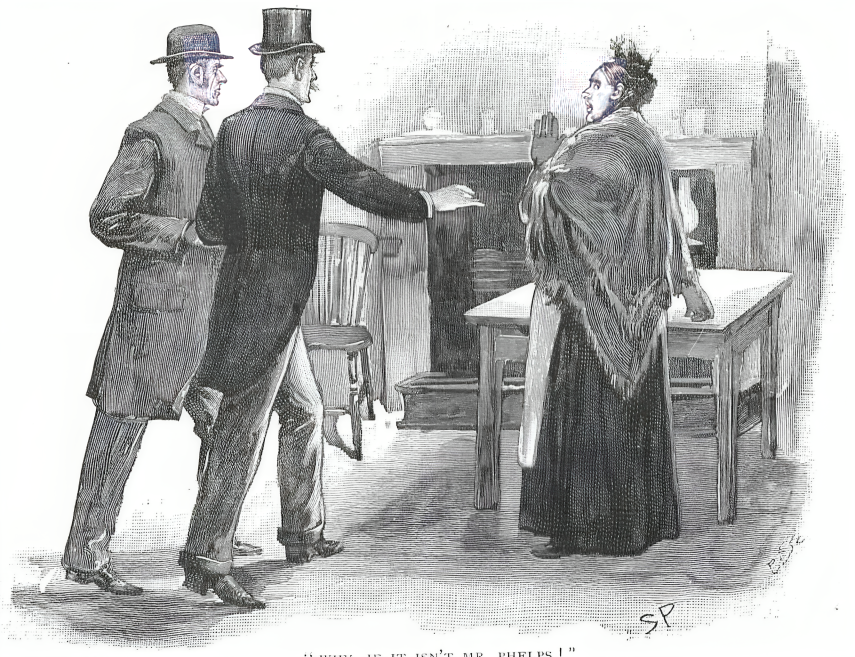

🤵🏻‍♂️ “Then for the first time the horror of my situation came in its full
force. Hitherto I had been acting, and action had numbed thought. I
had been so confident of regaining the treaty at once that I had not
dared to think of what would be the consequence if I failed to do so.
But now there was nothing more to be done, and I had leisure to
realize my position. It was horrible. Watson there would tell you
that I was a nervous, sensitive boy at school. It is my nature. I
thought of my uncle and of his colleagues in the Cabinet, of the
shame which I had brought upon him, upon myself, upon every one
connected with me. What though I was the victim of an extraordinary
accident? No allowance is made for accidents where diplomatic
interests are at stake. I was ruined, shamefully, hopelessly ruined.
I don’t know what I did. I fancy I must have made a scene. I have a
dim recollection of a group of officials who crowded round me,
endeavoring to soothe me. One of them drove down with me to Waterloo,
and saw me into the Woking train. I believe that he would have come
all the way had it not been that Dr. Ferrier, who lives near me, was
going down by that very train. The doctor most kindly took charge of
me, and it was well he did so, for I had a fit in the station, and
before we reached home I was practically a raving maniac.

🤵🏻‍♂️ “You can imagine the state of things here when they were roused from
their beds by the doctor’s ringing and found me in this condition.
Poor Annie here and my mother were broken-hearted. Dr. Ferrier had
just heard enough from the detective at the station to be able to
give an idea of what had happened, and his story did not mend
matters. It was evident to all that I was in for a long illness, so
Joseph was bundled out of this cheery bedroom, and it was turned into
a sick-room for me. Here I have lain, Mr. Holmes, for over nine
weeks, unconscious, and raving with brain-fever. If it had not been
for Miss Harrison here and for the doctor’s care I should not be
speaking to you now. She has nursed me by day and a hired nurse has
looked after me by night, for in my mad fits I was capable of
anything. Slowly my reason has cleared, but it is only during the
last three days that my memory has quite returned. Sometimes I wish
that it never had. The first thing that I did was to wire to Mr.
Forbes, who had the case in hand. He came out, and assures me that,
though everything has been done, no trace of a clue has been
discovered. The commissionaire and his wife have been examined in
every way without any light being thrown upon the matter. The
suspicions of the police then rested upon young Gorot, who, as you
may remember, stayed over time in the office that night. His
remaining behind and his French name were really the only two points
which could suggest suspicion; but, as a matter of fact, I did not
begin work until he had gone, and his people are of Huguenot
extraction, but as English in sympathy and tradition as you and I
are. Nothing was found to implicate him in any way, and there the
matter dropped. I turn to you, Mr. Holmes, as absolutely my last
hope. If you fail me, then my honor as well as my position are
forever forfeited.”

The invalid sank back upon his cushions, tired out by this long
recital, while his nurse poured him out a glass of some stimulating
medicine. Holmes sat silently, with his head thrown back and his eyes
closed, in an attitude which might seem listless to a stranger, but
which I knew betokened the most intense self-absorption.

🕵️‍♂️ “You statement has been so explicit,” said he at last, “that you have
really left me very few questions to ask. There is one of the very
utmost importance, however. Did you tell any one that you had this
special task to perform?”

🤵🏻‍♂️ “No one.”

🕵️‍♂️ “Not Miss Harrison here, for example?”

🤵🏻‍♂️ “No. I had not been back to Woking between getting the order and
executing the commission.”

🕵️‍♂️ “And none of your people had by chance been to see you?”

🤵🏻‍♂️ “None.”

🕵️‍♂️ “Did any of them know their way about in the office?”

🤵🏻‍♂️ “Oh, yes, all of them had been shown over it.”

🕵️‍♂️ “Still, of course, if you said nothing to any one about the treaty
these inquiries are irrelevant.”

🤵🏻‍♂️ “I said nothing.”

🕵️‍♂️ “Do you know anything of the commissionaire?”

🤵🏻‍♂️ “Nothing except that he is an old soldier.”

🕵️‍♂️ “What regiment?”

🤵🏻‍♂️ “Oh, I have heard--Coldstream Guards.”

🕵️‍♂️ “Thank you. I have no doubt I can get details from Forbes. The
authorities are excellent at amassing facts, though they do not
always use them to advantage. What a lovely thing a rose is!”

He walked past the couch to the open window, and held up the drooping
stalk of a moss-rose, looking down at the dainty blend of crimson and
green. It was a new phase of his character to me, for I had never
before seen him show any keen interest in natural objects.

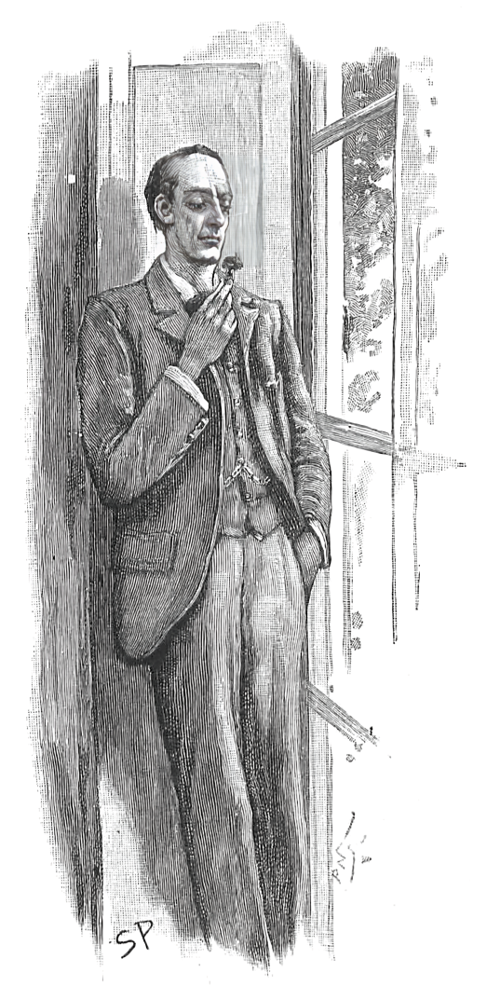

🕵️‍♂️ “There is nothing in which deduction is so necessary as in religion,”
said he, leaning with his back against the shutters. “It can be built
up as an exact science by the reasoner. Our highest assurance of the
goodness of Providence seems to me to rest in the flowers. All other
things, our powers our desires, our food, are all really necessary
for our existence in the first instance. But this rose is an extra.
Its smell and its color are an embellishment of life, not a condition
of it. It is only goodness which gives extras, and so I say again
that we have much to hope from the flowers.”

Percy Phelps and his nurse looked at Holmes during this demonstration
with surprise and a good deal of disappointment written upon their
faces. He had fallen into a reverie, with the moss-rose between his
fingers. It had lasted some minutes before the young lady broke in
upon it.

🤵🏻‍♂️ “Do you see any prospect of solving this mystery, Mr. Holmes?” she
asked, with a touch of asperity in her voice.

🕵️‍♂️ “Oh, the mystery!” he answered, coming back with a start to the
realities of life. “Well, it would be absurd to deny that the case is
a very abstruse and complicated one, but I can promise you that I
will look into the matter and let you know any points which may
strike me.”

🤵🏻‍♂️ “Do you see any clue?”

🕵️‍♂️ “You have furnished me with seven, but, of course, I must test them
before I can pronounce upon their value.”

🤵🏻‍♂️ “You suspect some one?”

🕵️‍♂️ “I suspect myself.”

🤵🏻‍♂️ “What!”

🕵️‍♂️ “Of coming to conclusions too rapidly.”

“Then go to London and test your conclusions.”

🕵️‍♂️ “Your advice is very excellent, Miss Harrison,” said Holmes, rising.

🕵️‍♂️ “I think, Watson, we cannot do better. Do not allow yourself to
indulge in false hopes, Mr. Phelps. The affair is a very tangled
one.”

🤵🏻‍♂️ “I shall be in a fever until I see you again,” cried the diplomatist.

“Well, I’ll come out by the same train to-morrow, though it’s more
than likely that my report will be a negative one.”

🤵🏻‍♂️ “God bless you for promising to come,” cried our client. “It gives me
fresh life to know that something is being done. By the way, I have
had a letter from Lord Holdhurst.”

🕵️‍♂️ “Ha! What did he say?”

“He was cold, but not harsh. I dare say my severe illness prevented
him from being that. He repeated that the matter was of the utmost
importance, and added that no steps would be taken about my
future--by which he means, of course, my dismissal--until my health
was restored and I had an opportunity of repairing my misfortune.”

🕵️‍♂️ “Well, that was reasonable and considerate,” said Holmes. “Come,
Watson, for we have a good day’s work before us in town.”

Mr. Joseph Harrison drove us down to the station, and we were soon
whirling up in a Portsmouth train. Holmes was sunk in profound
thought, and hardly opened his mouth until we had passed Clapham
Junction.

“It’s a very cheery thing to come into London by any of these lines
which run high, and allow you to look down upon the houses like
this.”

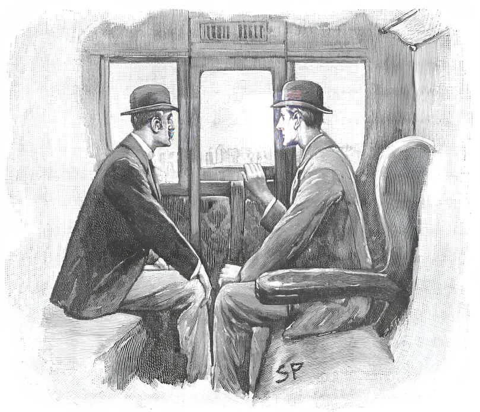

I thought he was joking, for the view was sordid enough, but he soon
explained himself.

“Look at those big, isolated clumps of building rising up above the
slates, like brick islands in a lead-colored sea.”

“The board-schools.”

“Light-houses, my boy! Beacons of the future! Capsules with hundreds
of bright little seeds in each, out of which will spring the wise,
better England of the future. I suppose that man Phelps does not
drink?”

“I should not think so.”

🕵️‍♂️ “Nor should I, but we are bound to take every possibility into
account. The poor devil has certainly got himself into very deep
water, and it’s a question whether we shall ever be able to get him
ashore. What did you think of Miss Harrison?”

“A girl of strong character.”

🕵️‍♂️ “Yes, but she is a good sort, or I am mistaken. She and her brother
are the only children of an iron-master somewhere up Northumberland
way. He got engaged to her when traveling last winter, and she came
down to be introduced to his people, with her brother as escort. Then
came the smash, and she stayed on to nurse her lover, while brother
Joseph, finding himself pretty snug, stayed on too. I’ve been making
a few independent inquiries, you see. But to-day must be a day of
inquiries.”

“My practice--” I began.

🕵️‍♂️ “Oh, if you find your own cases more interesting than mine--” said
Holmes, with some asperity.

“I was going to say that my practice could get along very well for a
day or two, since it is the slackest time in the year.”

🕵️‍♂️ “Excellent,” said he, recovering his good-humor. “Then we’ll look
into this matter together. I think that we should begin by seeing
Forbes. He can probably tell us all the details we want until we know
from what side the case is to be approached.”

“You said you had a clue?”

🕵️‍♂️ “Well, we have several, but we can only test their value by further
inquiry. The most difficult crime to track is the one which is
purposeless. Now this is not purposeless. Who is it who profits by
it? There is the French ambassador, there is the Russian, there is
who-ever might sell it to either of these, and there is Lord
Holdhurst.”

“Lord Holdhurst!”

🕵️‍♂️ “Well, it is just conceivable that a statesman might find himself in
a position where he was not sorry to have such a document
accidentally destroyed.”

“Not a statesman with the honorable record of Lord Holdhurst?”

🕵️‍♂️ “It is a possibility and we cannot afford to disregard it. We shall
see the noble lord to-day and find out if he can tell us anything.
Meanwhile I have already set inquiries on foot.”

“Already?”

🕵️‍♂️ “Yes, I sent wires from Woking station to every evening paper in
London. This advertisement will appear in each of them.”

He handed over a sheet torn from a note-book. On it was scribbled in
pencil:

“A £10 reward. The number of the cab which dropped a fare at or about
the door of the Foreign Office in Charles Street at quarter to ten in
the evening of May 23rd. Apply 221b, Baker Street.”

“You are confident that the thief came in a cab?”

🕵️‍♂️ “If not, there is no harm done. But if Mr. Phelps is correct in
stating that there is no hiding-place either in the room or the
corridors, then the person must have come from outside. If he came
from outside on so wet a night, and yet left no trace of damp upon
the linoleum, which was examined within a few minutes of his passing,
then it is exceeding probably that he came in a cab. Yes, I think
that we may safely deduce a cab.”

“It sounds plausible.”

🕵️‍♂️ “That is one of the clues of which I spoke. It may lead us to
something. And then, of course, there is the bell--which is the most
distinctive feature of the case. Why should the bell ring? Was it the
thief who did it out of bravado? Or was it some one who was with the
thief who did it in order to prevent the crime? Or was it an
accident? Or was it--?” He sank back into the state of intense and
silent thought from which he had emerged; but it seemed to me,
accustomed as I was to his every mood, that some new possibility had
dawned suddenly upon him.

It was twenty past three when we reached our terminus, and after a
hasty luncheon at the buffet we pushed on at once to Scotland Yard.
Holmes had already wired to Forbes, and we found him waiting to
receive us--a small, foxy man with a sharp but by no means amiable
expression. He was decidedly frigid in his manner to us, especially
when he heard the errand upon which we had come.

“I’ve heard of your methods before now, Mr. Holmes,” said he, tartly.
“You are ready enough to use all the information that the police can
lay at your disposal, and then you try to finish the case yourself
and bring discredit on them.”

🕵️‍♂️ “On the contrary,” said Holmes, “out of my last fifty-three cases my
name has only appeared in four, and the police have had all the
credit in forty-nine. I don’t blame you for not knowing this, for you
are young and inexperienced, but if you wish to get on in your new
duties you will work with me and not against me.”

👨🏻‍💼 “I’d be very glad of a hint or two,” said the detective, changing his
manner. “I’ve certainly had no credit from the case so far.”

🕵️‍♂️ “What steps have you taken?”

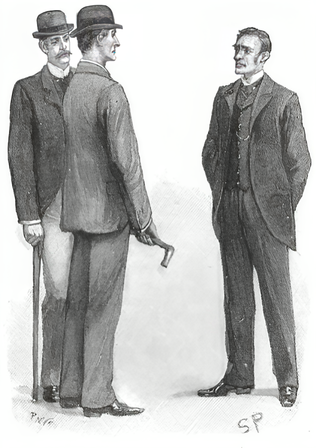

👨🏻‍💼 “Tangey, the commissionaire, has been shadowed. He left the Guards
with a good character and we can find nothing against him. His wife
is a bad lot, though. I fancy she knows more about this than
appears.”

🕵️‍♂️ “Have you shadowed her?”

👨🏻‍💼 “We have set one of our women on to her. Mrs. Tangey drinks, and our
woman has been with her twice when she was well on, but she could get
nothing out of her.”

🕵️‍♂️ “I understand that they have had brokers in the house?”

👨🏻‍💼 “Yes, but they were paid off.”

🕵️‍♂️ “Where did the money come from?”

👨🏻‍💼 “That was all right. His pension was due. They have not shown any
sign of being in funds.”

🕵️‍♂️ “What explanation did she give of having answered the bell when Mr.
Phelps rang for the coffee?”

👨🏻‍💼 “She said that he husband was very tired and she wished to relieve
him.”

🕵️‍♂️ “Well, certainly that would agree with his being found a little later
asleep in his chair. There is nothing against them then but the
woman’s character. Did you ask her why she hurried away that night?
Her haste attracted the attention of the police constable.”

👨🏻‍💼 “She was later than usual and wanted to get home.”

🕵️‍♂️ “Did you point out to her that you and Mr. Phelps, who started at
least twenty minutes after he, got home before her?”

👨🏻‍💼 “She explains that by the difference between a ’bus and a hansom.”

🕵️‍♂️ “Did she make it clear why, on reaching her house, she ran into the
back kitchen?”

👨🏻‍💼 “Because she had the money there with which to pay off the brokers.”

🕵️‍♂️ “She has at least an answer for everything. Did you ask her whether
in leaving she met any one or saw any one loitering about Charles
Street?”

👨🏻‍💼 “She saw no one but the constable.”

🕵️‍♂️ “Well, you seem to have cross-examined her pretty thoroughly. What
else have you done?”

👨🏻‍💼 “The clerk Gorot has been shadowed all these nine weeks, but without
result. We can show nothing against him.”

🕵️‍♂️ “Anything else?”

👨🏻‍💼 “Well, we have nothing else to go upon--no evidence of any kind.”

🕵️‍♂️ “Have you formed a theory about how that bell rang?”

👨🏻‍💼 “Well, I must confess that it beats me. It was a cool hand, whoever
it was, to go and give the alarm like that.”

🕵️‍♂️ “Yes, it was a queer thing to do. Many thanks to you for what you
have told me. If I can put the man into your hands you shall hear
from me. Come along, Watson.”

“Where are we going to now?” I asked, as we left the office.

🕵️‍♂️ “We are now going to interview Lord Holdhurst, the cabinet minister
and future premier of England.”

We were fortunate in finding that Lord Holdhurst was still in his
chambers in Downing Street, and on Holmes sending in his card we were
instantly shown up. The statesman received us with that old-fashioned
courtesy for which he is remarkable, and seated us on the two
luxuriant lounges on either side of the fireplace. Standing on the
rug between us, with his slight, tall figure, his sharp features,
thoughtful face, and curling hair prematurely tinged with gray, he
seemed to represent that not too common type, a nobleman who is in
truth noble.

“Your name is very familiar to me, Mr. Holmes,” said he, smiling.
“And, of course, I cannot pretend to be ignorant of the object of
your visit. There has only been one occurrence in these offices which
could call for your attention. In whose interest are you acting, may
I ask?”

🕵️‍♂️ “In that of Mr. Percy Phelps,” answered Holmes.

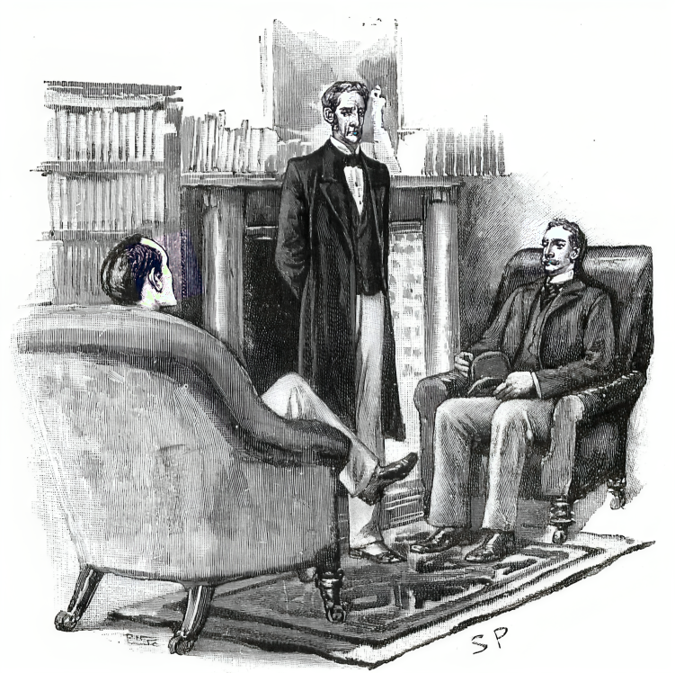

“Ah, my unfortunate nephew! You can understand that our kinship makes
it the more impossible for me to screen him in any way. I fear that
the incident must have a very prejudicial effect upon his career.”

🕵️‍♂️ “But if the document is found?”

“Ah, that, of course, would be different.”

🕵️‍♂️ “I had one or two questions which I wished to ask you, Lord
Holdhurst.”

“I shall be happy to give you any information in my power.”

🕵️‍♂️ “Was it in this room that you gave your instructions as to the
copying of the document?”

“It was.”

🕵️‍♂️ “Then you could hardly have been overheard?”

“It is out of the question.”

🕵️‍♂️ “Did you ever mention to any one that it was your intention to give
any one the treaty to be copied?”

“Never.”

🕵️‍♂️ “You are certain of that?”

“Absolutely.”

🕵️‍♂️ “Well, since you never said so, and Mr. Phelps never said so, and
nobody else knew anything of the matter, then the thief’s presence in
the room was purely accidental. He saw his chance and he took it.”

The statesman smiled. “You take me out of my province there,” said
he.

Holmes considered for a moment. 

🕵️‍♂️ “There is another very important
point which I wish to discuss with you,” said he. “You feared, as I
understand, that very grave results might follow from the details of
this treaty becoming known.”

A shadow passed over the expressive face of the statesman. “Very
grave results indeed.”

🕵️‍♂️ “And have they occurred?”

“Not yet.”

🕵️‍♂️ “If the treaty had reached, let us say, the French or Russian Foreign
Office, you would expect to hear of it?”

“I should,” said Lord Holdhurst, with a wry face.

🕵️‍♂️ “Since nearly ten weeks have elapsed, then, and nothing has been
heard, it is not unfair to suppose that for some reason the treaty
has not reached them.”

Lord Holdhurst shrugged his shoulders.

“We can hardly suppose, Mr. Holmes, that the thief took the treaty in
order to frame it and hang it up.”

🕵️‍♂️ “Perhaps he is waiting for a better price.”

“If he waits a little longer he will get no price at all. The treaty
will cease to be secret in a few months.”

🕵️‍♂️ “That is most important,” said Holmes. “Of course, it is a possible
supposition that the thief has had a sudden illness--”

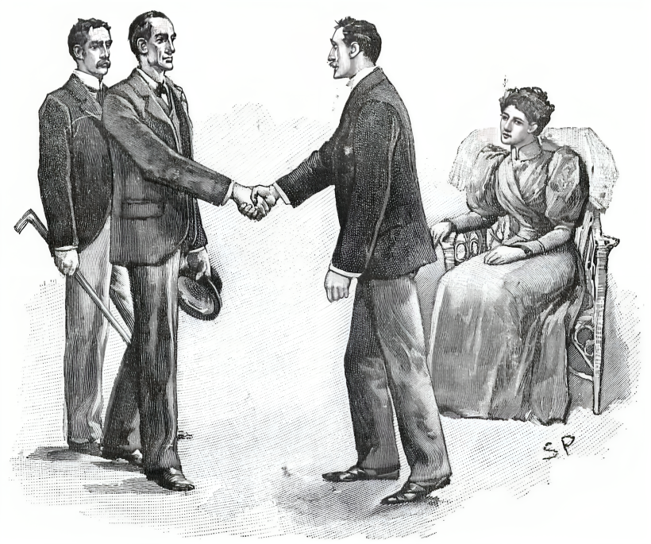

“An attack of brain-fever, for example?” asked the statesman,
flashing a swift glance at him.

🕵️‍♂️ “I did not say so,” said Holmes, imperturbably. “And now, Lord
Holdhurst, we have already taken up too much of your valuable time,
and we shall wish you good-day.”

“Every success to your investigation, be the criminal who it may,”
answered the nobleman, as he bowed us out the door.

🕵️‍♂️ “He’s a fine fellow,” said Holmes, as we came out into Whitehall.
“But he has a struggle to keep up his position. He is far from rich
and has many calls. You noticed, of course, that his boots had been
re-soled? Now, Watson, I won’t detain you from your legitimate work
any longer. I shall do nothing more to-day, unless I have an answer
to my cab advertisement. But I should be extremely obliged to you if
you would come down with me to Woking to-morrow, by the same train
which we took yesterday.”

I met him accordingly next morning and we traveled down to Woking
together. He had had no answer to his advertisement, he said, and no
fresh light had been thrown upon the case. He had, when he so willed
it, the utter immobility of countenance of a red Indian, and I could
not gather from his appearance whether he was satisfied or not with
the position of the case. His conversation, I remember, was about the
Bertillon system of measurements, and he expressed his enthusiastic
admiration of the French savant.

We found our client still under the charge of his devoted nurse, but
looking considerably better than before. He rose from the sofa and
greeted us without difficulty when we entered.

“Any news?” he asked, eagerly.

“My report, as I expected, is a negative one,” said Holmes. “I have
seen Forbes, and I have seen your uncle, and I have set one or two
trains of inquiry upon foot which may lead to something.”

“You have not lost heart, then?”

“By no means.”

“God bless you for saying that!” cried Miss Harrison. “If we keep our
courage and our patience the truth must come out.”

“We have more to tell you than you have for us,” said Phelps,
reseating himself upon the couch.

“I hoped you might have something.”

“Yes, we have had an adventure during the night, and one which might
have proved to be a serious one.” His expression grew very grave as
he spoke, and a look of something akin to fear sprang up in his eyes.
“Do you know,” said he, “that I begin to believe that I am the
unconscious centre of some monstrous conspiracy, and that my life is
aimed at as well as my honor?”

“Ah!” cried Holmes.

“It sounds incredible, for I have not, as far as I know, an enemy in
the world. Yet from last night’s experience I can come to no other
conclusion.”

“Pray let me hear it.”

“You must know that last night was the very first night that I have
ever slept without a nurse in the room. I was so much better that I
thought I could dispense with one. I had a night-light burning,
however. Well, about two in the morning I had sunk into a light sleep
when I was suddenly aroused by a slight noise. It was like the sound
which a mouse makes when it is gnawing a plank, and I lay listening
to it for some time under the impression that it must come from that
cause. Then it grew louder, and suddenly there came from the window a
sharp metallic snick. I sat up in amazement. There could be no doubt
what the sounds were now. The first ones had been caused by some one
forcing an instrument through the slit between the sashes, and the
second by the catch being pressed back.

“There was a pause then for about ten minutes, as if the person were
waiting to see whether the noise had awakened me. Then I heard a
gentle creaking as the window was very slowly opened. I could stand
it no longer, for my nerves are not what they used to be. I sprang
out of bed and flung open the shutters. A man was crouching at the
window. I could see little of him, for he was gone like a flash. He
was wrapped in some sort of cloak which came across the lower part of
his face. One thing only I am sure of, and that is that he had some
weapon in his hand. It looked to me like a long knife. I distinctly
saw the gleam of it as he turned to run.”

“This is most interesting,” said Holmes. “Pray what did you do then?”

“I should have followed him through the open window if I had been
stronger. As it was, I rang the bell and roused the house. It took me
some little time, for the bell rings in the kitchen and the servants
all sleep upstairs. I shouted, however, and that brought Joseph down,
and he roused the others. Joseph and the groom found marks on the bed
outside the window, but the weather has been so dry lately that they
found it hopeless to follow the trail across the grass. There’s a
place, however, on the wooden fence which skirts the road which shows
signs, they tell me, as if some one had got over, and had snapped the
top of the rail in doing so. I have said nothing to the local police
yet, for I thought I had best have your opinion first.”

This tale of our client’s appeared to have an extraordinary effect
upon Sherlock Holmes. He rose from his chair and paced about the room
in uncontrollable excitement.

“Misfortunes never come single,” said Phelps, smiling, though it was
evident that his adventure had somewhat shaken him.

“You have certainly had your share,” said Holmes. “Do you think you
could walk round the house with me?”

“Oh, yes, I should like a little sunshine. Joseph will come, too.”

“And I also,” said Miss Harrison.

“I am afraid not,” said Holmes, shaking his head. “I think I must ask
you to remain sitting exactly where you are.”

The young lady resumed her seat with an air of displeasure. Her
brother, however, had joined us and we set off all four together. We
passed round the lawn to the outside of the young diplomatist’s
window. There were, as he had said, marks upon the bed, but they were
hopelessly blurred and vague. Holmes stopped over them for an
instant, and then rose shrugging his shoulders.

“I don’t think any one could make much of this,” said he. “Let us go
round the house and see why this particular room was chose by the
burglar. I should have thought those larger windows of the
drawing-room and dining-room would have had more attractions for
him.”

“They are more visible from the road,” suggested Mr. Joseph Harrison.

“Ah, yes, of course. There is a door here which he might have
attempted. What is it for?”

“It is the side entrance for trades-people. Of course it is locked at
night.”

“Have you ever had an alarm like this before?”

“Never,” said our client.

“Do you keep plate in the house, or anything to attract burglars?”

“Nothing of value.”

Holmes strolled round the house with his hands in his pockets and a
negligent air which was unusual with him.

“By the way,” said he to Joseph Harrison, “you found some place, I
understand, where the fellow scaled the fence. Let us have a look at
that!”

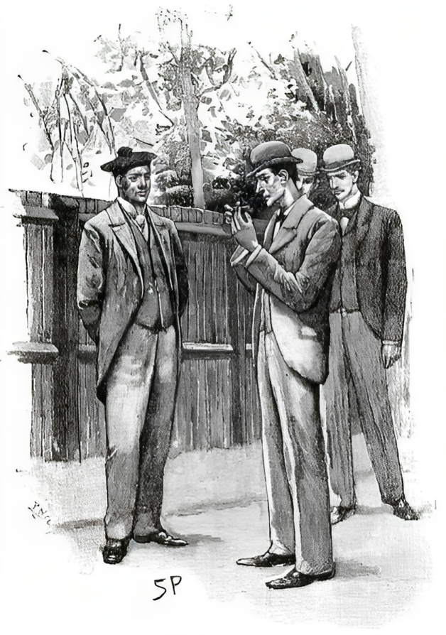

The plump young man led us to a spot where the top of one of the
wooden rails had been cracked. A small fragment of the wood was
hanging down. Holmes pulled it off and examined it critically.

“Do you think that was done last night? It looks rather old, does it
not?”

“Well, possibly so.”

“There are no marks of any one jumping down upon the other side. No,
I fancy we shall get no help here. Let us go back to the bedroom and
talk the matter over.”

Percy Phelps was walking very slowly, leaning upon the arm of his
future brother-in-law. Holmes walked swiftly across the lawn, and we
were at the open window of the bedroom long before the others came
up.

“Miss Harrison,” said Holmes, speaking with the utmost intensity of
manner, “you must stay where you are all day. Let nothing prevent you
from staying where you are all day. It is of the utmost importance.”

“Certainly, if you wish it, Mr. Holmes,” said the girl in
astonishment.

“When you go to bed lock the door of this room on the outside and
keep the key. Promise to do this.”

“But Percy?”

“He will come to London with us.”

“And am I to remain here?”

“It is for his sake. You can serve him. Quick! Promise!”

She gave a quick nod of assent just as the other two came up.

“Why do you sit moping there, Annie?” cried her brother. “Come out
into the sunshine!”

“No, thank you, Joseph. I have a slight headache and this room is
deliciously cool and soothing.”

“What do you propose now, Mr. Holmes?” asked our client.

“Well, in investigating this minor affair we must not lose sight of
our main inquiry. It would be a very great help to me if you would
come up to London with us.”

“At once?”

“Well, as soon as you conveniently can. Say in an hour.”

“I feel quite strong enough, if I can really be of any help.”

“The greatest possible.”

“Perhaps you would like me to stay there to-night?”

“I was just going to propose it.”

“Then, if my friend of the night comes to revisit me, he will find
the bird flown. We are all in your hands, Mr. Holmes, and you must
tell us exactly what you would like done. Perhaps you would prefer
that Joseph came with us so as to look after me?”

“Oh, no; my friend Watson is a medical man, you know, and he’ll look
after you. We’ll have our lunch here, if you will permit us, and then
we shall all three set off for town together.”

It was arranged as he suggested, though Miss Harrison excused herself
from leaving the bedroom, in accordance with Holmes’s suggestion.
What the object of my friend’s manoeuvres was I could not conceive,
unless it were to keep the lady away from Phelps, who, rejoiced by
his returning health and by the prospect of action, lunched with us
in the dining-room. Holmes had still more startling surprise for us,
however, for, after accompanying us down to the station and seeing us
into our carriage, he calmly announced that he had no intention of
leaving Woking.

“There are one or two small points which I should desire to clear up
before I go,” said he. “Your absence, Mr. Phelps, will in some ways
rather assist me. Watson, when you reach London you would oblige me
by driving at once to Baker Street with our friend here, and
remaining with him until I see you again. It is fortunate that you
are old school-fellows, as you must have much to talk over. Mr.
Phelps can have the spare bedroom to-night, and I will be with you in
time for breakfast, for there is a train which will take me into
Waterloo at eight.”

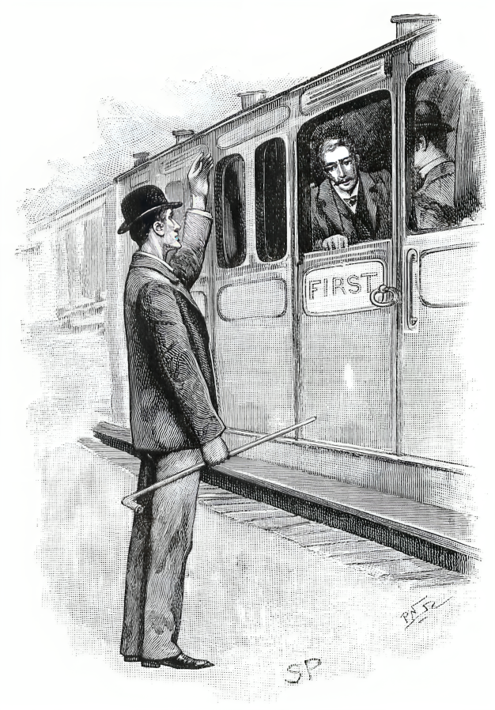

“But how about our investigation in London?” asked Phelps, ruefully.

“We can do that to-morrow. I think that just at present I can be of
more immediate use here.”

“You might tell them at Briarbrae that I hope to be back to-morrow
night,” cried Phelps, as we began to move from the platform.

“I hardly expect to go back to Briarbrae,” answered Holmes, and waved
his hand to us cheerily as we shot out from the station.

Phelps and I talked it over on our journey, but neither of us could
devise a satisfactory reason for this new development.

“I suppose he wants to find out some clue as to the burglary last
night, if a burglar it was. For myself, I don’t believe it was an
ordinary thief.”

“What is your own idea, then?”

“Upon my word, you may put it down to my weak nerves or not, but I
believe there is some deep political intrigue going on around me, and
that for some reason that passes my understanding my life is aimed at
by the conspirators. It sounds high-flown and absurd, but consider
the facts! Why should a thief try to break in at a bedroom window,
where there could be no hope of any plunder, and why should he come
with a long knife in his hand?”

“You are sure it was not a house-breaker’s jimmy?”

“Oh, no, it was a knife. I saw the flash of the blade quite
distinctly.”

“But why on earth should you be pursued with such animosity?”

“Ah, that is the question.”

“Well, if Holmes takes the same view, that would account for his
action, would it not? Presuming that your theory is correct, if he
can lay his hands upon the man who threatened you last night he will
have gone a long way towards finding who took the naval treaty. It is
absurd to suppose that you have two enemies, one of whom robs you,
while the other threatens your life.”

“But Holmes said that he was not going to Briarbrae.”

“I have known him for some time,” said I, “but I never knew him do
anything yet without a very good reason,” and with that our
conversation drifted off on to other topics.

But it was a weary day for me. Phelps was still weak after his long
illness, and his misfortune made him querulous and nervous. In vain I
endeavored to interest him in Afghanistan, in India, in social
questions, in anything which might take his mind out of the groove.
He would always come back to his lost treaty, wondering, guessing,
speculating, as to what Holmes was doing, what steps Lord Holdhurst
was taking, what news we should have in the morning. As the evening
wore on his excitement became quite painful.

“You have implicit faith in Holmes?” he asked.

“I have seen him do some remarkable things.”

“But he never brought light into anything quite so dark as this?”

“Oh, yes, I have known him solve questions which presented fewer
clues than yours.”

“But not where such large interests are at stake?”

“I don’t know that. To my certain knowledge he has acted on behalf of
three of the reigning houses of Europe in very vital matters.”

“But you know him well, Watson. He is such an inscrutable fellow that
I never quite know what to make of him. Do you think he is hopeful?
Do you think he expects to make a success of it?”

“He has said nothing.”

“That is a bad sign.”

“On the contrary, I have noticed that when he is off the trail he
generally says so. It is when he is on a scent and is not quite
absolutely sure yet that it is the right one that he is most
taciturn. Now, my dear fellow, we can’t help matters by making
ourselves nervous about them, so let me implore you to go to bed and
so be fresh for whatever may await us to-morrow.”

I was able at last to persuade my companion to take my advice, though
I knew from his excited manner that there was not much hope of sleep
for him. Indeed, his mood was infectious, for I lay tossing half the
night myself, brooding over this strange problem, and inventing a
hundred theories, each of which was more impossible than the last.
Why had Holmes remained at Woking? Why had he asked Miss Harrison to
remain in the sick-room all day? Why had he been so careful not to
inform the people at Briarbrae that he intended to remain near them?
I cudgelled my brains until I fell asleep in the endeavor to find
some explanation which would cover all these facts.

It was seven o’clock when I awoke, and I set off at once for Phelps’s
room, to find him haggard and spent after a sleepless night. His
first question was whether Holmes had arrived yet.

“He’ll be here when he promised,” said I, “and not an instant sooner
or later.”

And my words were true, for shortly after eight a hansom dashed up to
the door and our friend got out of it. Standing in the window we saw
that his left hand was swathed in a bandage and that his face was
very grim and pale. He entered the house, but it was some little time
before he came upstairs.

“He looks like a beaten man,” cried Phelps.

I was forced to confess that he was right. “After all,” said I, “the
clue of the matter lies probably here in town.”

Phelps gave a groan.

“I don’t know how it is,” said he, “but I had hoped for so much from
his return. But surely his hand was not tied up like that yesterday.
What can be the matter?”

“You are not wounded, Holmes?” I asked, as my friend entered the
room.

“Tut, it is only a scratch through my own clumsiness,” he answered,
nodding his good-mornings to us. “This case of yours, Mr. Phelps, is
certainly one of the darkest which I have ever investigated.”

“I feared that you would find it beyond you.”

“It has been a most remarkable experience.”

“That bandage tells of adventures,” said I. “Won’t you tell us what
has happened?”

“After breakfast, my dear Watson. Remember that I have breathed
thirty miles of Surrey air this morning. I suppose that there has
been no answer from my cabman advertisement? Well, well, we cannot
expect to score every time.”

The table was all laid, and just as I was about to ring Mrs. Hudson
entered with the tea and coffee. A few minutes later she brought in
three covers, and we all drew up to the table, Holmes ravenous, I
curious, and Phelps in the gloomiest state of depression.

“Mrs. Hudson has risen to the occasion,” said Holmes, uncovering a
dish of curried chicken. “Her cuisine is a little limited, but she
has as good an idea of breakfast as a Scotch-woman. What have you
here, Watson?”

“Ham and eggs,” I answered.

“Good! What are you going to take, Mr. Phelps--curried fowl or eggs,
or will you help yourself?”

“Thank you. I can eat nothing,” said Phelps.

“Oh, come! Try the dish before you.”

“Thank you, I would really rather not.”

“Well, then,” said Holmes, with a mischievous twinkle, “I suppose
that you have no objection to helping me?”

Phelps raised the cover, and as he did so he uttered a scream, and
sat there staring with a face as white as the plate upon which he
looked. Across the centre of it was lying a little cylinder of
blue-gray paper. He caught it up, devoured it with his eyes, and then
danced madly about the room, passing it to his bosom and shrieking
out in his delight. Then he fell back into an arm-chair so limp and
exhausted with his own emotions that we had to pour brandy down his
throat to keep him from fainting.

“There! there!” said Holmes, soothing, patting him upon the shoulder.
“It was too bad to spring it on you like this, but Watson here will
tell you that I never can resist a touch of the dramatic.”

Phelps seized his hand and kissed it. “God bless you!” he cried. “You
have saved my honor.”

“Well, my own was at stake, you know,” said Holmes. “I assure you it
is just as hateful to me to fail in a case as it can be to you to
blunder over a commission.”

Phelps thrust away the precious document into the innermost pocket of
his coat.

“I have not the heart to interrupt your breakfast any further, and
yet I am dying to know how you got it and where it was.”

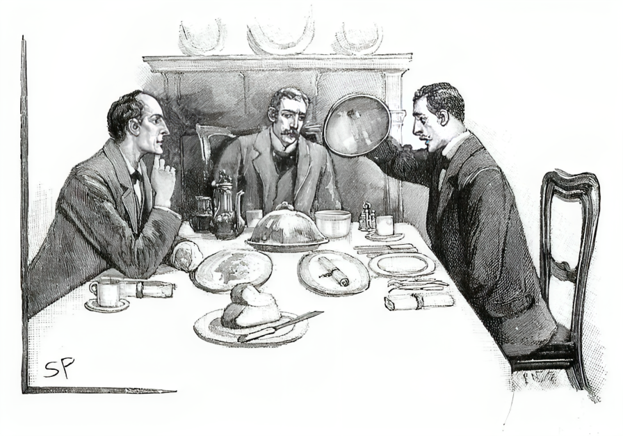

Sherlock Holmes swallowed a cup of coffee, and turned his attention
to the ham and eggs. Then he rose, lit his pipe, and settled himself
down into his chair.

“I’ll tell you what I did first, and how I came to do it afterwards,”
said he. “After leaving you at the station I went for a charming walk
through some admirable Surrey scenery to a pretty little village
called Ripley, where I had my tea at an inn, and took the precaution
of filling my flask and of putting a paper of sandwiches in my
pocket. There I remained until evening, when I set off for Woking
again, and found myself in the high-road outside Briarbrae just after
sunset.

“Well, I waited until the road was clear--it is never a very
frequented one at any time, I fancy--and then I clambered over the
fence into the grounds.”

“Surely the gate was open!” ejaculated Phelps.

“Yes, but I have a peculiar taste in these matters. I chose the place
where the three fir-trees stand, and behind their screen I got over
without the least chance of any one in the house being able to see
me. I crouched down among the bushes on the other side, and crawled
from one to the other--witness the disreputable state of my trouser
knees--until I had reached the clump of rhododendrons just opposite
to your bedroom window. There I squatted down and awaited
developments.

“The blind was not down in your room, and I could see Miss Harrison
sitting there reading by the table. It was quarter-past ten when she
closed her book, fastened the shutters, and retired.

“I heard her shut the door, and felt quite sure that she had turned
the key in the lock.”

“The key!” ejaculated Phelps.

“Yes, I had given Miss Harrison instructions to lock the door on the
outside and take the key with her when she went to bed. She carried
out every one of my injunctions to the letter, and certainly without
her cooperation you would not have that paper in you coat-pocket. She
departed then and the lights went out, and I was left squatting in
the rhododendron-bush.

“The night was fine, but still it was a very weary vigil. Of course
it has the sort of excitement about it that the sportsman feels when
he lies beside the water-course and waits for the big game. It was
very long, though--almost as long, Watson, as when you and I waited
in that deadly room when we looked into the little problem of the
Speckled Band. There was a church-clock down at Woking which struck
the quarters, and I thought more than once that it had stopped. At
last however about two in the morning, I suddenly heard the gentle
sound of a bolt being pushed back and the creaking of a key. A moment
later the servant’s door was opened, and Mr. Joseph Harrison stepped
out into the moonlight.”

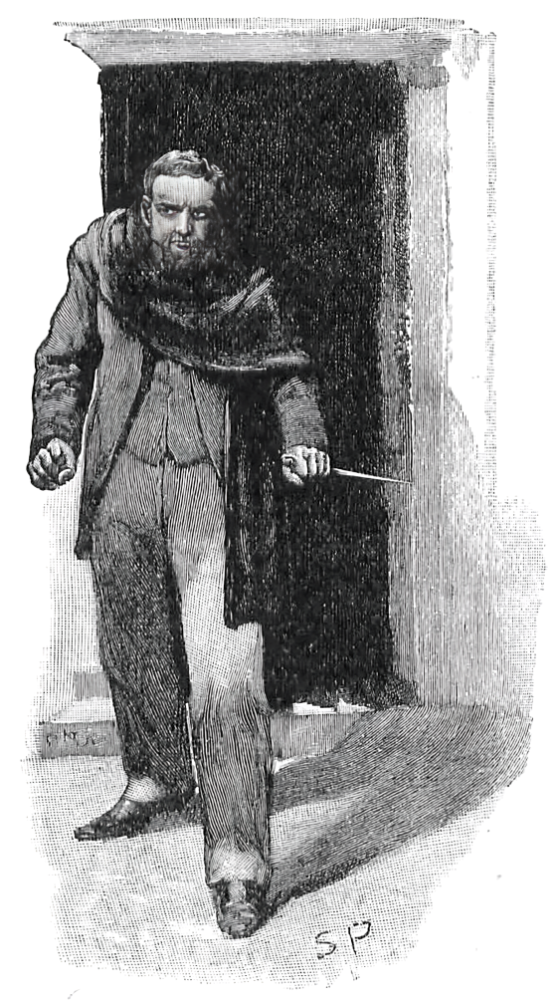

“Joseph!” ejaculated Phelps.

“He was bare-headed, but he had a black coat thrown over his shoulder
so that he could conceal his face in an instant if there were any
alarm. He walked on tiptoe under the shadow of the wall, and when he
reached the window he worked a long-bladed knife through the sash and
pushed back the catch. Then he flung open the window, and putting his
knife through the crack in the shutters, he thrust the bar up and
swung them open.

“From where I lay I had a perfect view of the inside of the room and
of every one of his movements. He lit the two candles which stood
upon the mantelpiece, and then he proceeded to turn back the corner
of the carpet in the neighborhood of the door. Presently he stopped
and picked out a square piece of board, such as is usually left to
enable plumbers to get at the joints of the gas-pipes. This one
covered, as a matter of fact, the T joint which gives off the pipe
which supplies the kitchen underneath. Out of this hiding-place he
drew that little cylinder of paper, pushed down the board, rearranged
the carpet, blew out the candles, and walked straight into my arms as
I stood waiting for him outside the window.

“Well, he has rather more viciousness than I gave him credit for, has
Master Joseph. He flew at me with his knife, and I had to grasp him
twice, and got a cut over the knuckles, before I had the upper hand
of him. He looked murder out of the only eye he could see with when
we had finished, but he listened to reason and gave up the papers.
Having got them I let my man go, but I wired full particulars to
Forbes this morning. If he is quick enough to catch his bird, well
and good. But if, as I shrewdly suspect, he finds the nest empty
before he gets there, why, all the better for the government. I fancy
that Lord Holdhurst for one, and Mr. Percy Phelps for another, would
very much rather that the affair never got as far as a police-court.

“My God!” gasped our client. “Do you tell me that during these long
ten weeks of agony the stolen papers were within the very room with
me all the time?”

“So it was.”

“And Joseph! Joseph a villain and a thief!”

“Hum! I am afraid Joseph’s character is a rather deeper and more
dangerous one than one might judge from his appearance. From what I
have heard from him this morning, I gather that he has lost heavily
in dabbling with stocks, and that he is ready to do anything on earth
to better his fortunes. Being an absolutely selfish man, when a
chance presented itself he did not allow either his sister’s
happiness or your reputation to hold his hand.”

Percy Phelps sank back in his chair. “My head whirls,” said he. “Your
words have dazed me.”

“The principal difficulty in your case,” remarked Holmes, in his
didactic fashion, “lay in the fact of there being too much evidence.
What was vital was overlaid and hidden by what was irrelevant. Of all
the facts which were presented to us we had to pick just those which
we deemed to be essential, and then piece them together in their
order, so as to reconstruct this very remarkable chain of events. I
had already begun to suspect Joseph, from the fact that you had
intended to travel home with him that night, and that therefore it
was a likely enough thing that he should call for you, knowing the
Foreign Office well, upon his way. When I heard that some one had
been so anxious to get into the bedroom, in which no one but Joseph
could have concealed anything--you told us in your narrative how you
had turned Joseph out when you arrived with the doctor--my suspicions
all changed to certainties, especially as the attempt was made on the
first night upon which the nurse was absent, showing that the
intruder was well acquainted with the ways of the house.”

“How blind I have been!”

“The facts of the case, as far as I have worked them out, are these:
this Joseph Harrison entered the office through the Charles Street
door, and knowing his way he walked straight into your room the
instant after you left it. Finding no one there he promptly rang the
bell, and at the instant that he did so his eyes caught the paper
upon the table. A glance showed him that chance had put in his way a
State document of immense value, and in an instant he had thrust it
into his pocket and was gone. A few minutes elapsed, as you remember,
before the sleepy commissionaire drew your attention to the bell, and
those were just enough to give the thief time to make his escape.

“He made his way to Woking by the first train, and having examined
his booty and assured himself that it really was of immense value, he
had concealed it in what he thought was a very safe place, with the
intention of taking it out again in a day or two, and carrying it to
the French embassy, or wherever he thought that a long price was to
be had. Then came your sudden return. He, without a moment’s warning,
was bundled out of his room, and from that time onward there were
always at least two of you there to prevent him from regaining his
treasure. The situation to him must have been a maddening one. But at
last he thought he saw his chance. He tried to steal in, but was
baffled by your wakefulness. You remember that you did not take your
usual draught that night.”

“I remember.”

“I fancy that he had taken steps to make that draught efficacious,
and that he quite relied upon your being unconscious. Of course, I
understood that he would repeat the attempt whenever it could be done
with safety. Your leaving the room gave him the chance he wanted. I
kept Miss Harrison in it all day so that he might not anticipate us.
Then, having given him the idea that the coast was clear, I kept
guard as I have described. I already knew that the papers were
probably in the room, but I had no desire to rip up all the planking
and skirting in search of them. I let him take them, therefore, from
the hiding-place, and so saved myself an infinity of trouble. Is
there any other point which I can make clear?”

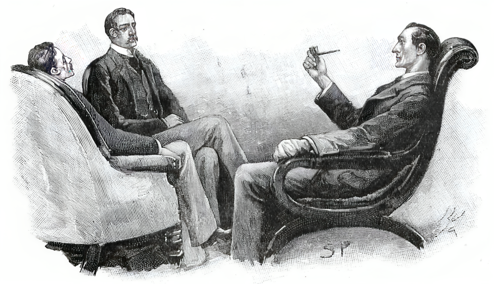

“Why did he try the window on the first occasion,” I asked, “when he
might have entered by the door?”

“In reaching the door he would have to pass seven bedrooms. On the
other hand, he could get out on to the lawn with ease. Anything
else?”

“You do not think,” asked Phelps, “that he had any murderous
intention? The knife was only meant as a tool.”

“It may be so,” answered Holmes, shrugging his shoulders. “I can only
say for certain that Mr. Joseph Harrison is a gentleman to whose
mercy I should be extremely unwilling to trust.”

&nbsp;

&nbsp;

&nbsp;

---

[🎬 TV show](4EkY1PdMl5g){:.v}

This text is provided to you “as-is” without any warranty. No
warranties of any kind, expressed or implied, are made to you as to
the text or any medium it may be on, including but not limited to
warranties of merchantablity or fitness for a particular purpose.

This text was formatted from various free ASCII and HTML variants.
See [http://sherlock-holm.es](http://sherlock-holm.es){:target="ext"} for an electronic form of this text and
additional information about it.

Pictures for “The Naval Treaty” were taken from a 1911 edition of
“The Memoirs of Sherlock Holmes” by Smith, Elder & Co. of London.

This text comes from the collection’s version 3.1.

 